<div align="center">



<a href="https://github.com/Aditya152602">
  
</a>

<br/>


</div>

<br/>

## 🧑‍💻 `whoami`

```bash
aditya@dev:~$ whoami
Aditya Dhar Dwivedi — AI/ML Engineer & Java Spring Boot Developer

aditya@dev:~$ cat education.log
B.Tech CSE (AI & ML) @ Dr. APJ Abdul Kalam Technical University (AKTU)
Class of 2027 · Lucknow, India

aditya@dev:~$ ./list_experience.sh --internships
[✓] Handshake AI                     — Project Dynamo, SE Track
[✓] Lenovo India
[✓] DITS Company India
[✓] Edunet Foundation × IBM SkillsBuild
[✓] CSRBOX

aditya@dev:~$ cat currently.md
> Training   : ISRO AI/ML for Geodata Analysis · NASA ARSET Remote Sensing
> Programme  : Pega × SmartBridge National Internship
> Sharpening : Data Structures & Algorithms (Java) for campus placements
> Shipping   : agentic AI systems, geospatial AI experiments

aditya@dev:~$ echo $STATUS
Open to full-time roles, internships & interesting collaborations ⚡
```

<br/>

## 🛰️ Training & Credentials

| Status | Programme |
|:---:|---|
| ✅ | **AI/ML for Geodata Analysis** — ISRO/IIRS (Course ID 468) |
| ✅ | **Generative AI** — NVIDIA |
| ✅ | **AI Classroom** — JIO |
| ✅ | **Claude with the Anthropic API** — Anthropic |
| 🔄 | **AI/ML for Geodata Analysis** — ISRO Online Training Programme *(active)* |
| 🔄 | **Remote Sensing Certification** — NASA ARSET *(in progress)* |
| 🔄 | **National Internship Programme** — Pega × SmartBridge *(active)* |

<br/>

## 🧬 Skill Matrix

**Core proficiency** — evidenced by shipped, deployed work:

```text
Java · Spring Boot        ████████░░  demonstrated · DSA fluency, backend focus
Python · Flask / Django   █████████░  2 deployed production apps
React                     ███████░░░  1 deployed production app
LLM Integration (AI SDKs) ████████░░  3 deployed AI agents
Geospatial AI              █████░░░░░  active training, not yet shipped
```

<table>
<tr><td valign="top">

**Languages**
<br/>


</td><td valign="top">

**Backend & Frameworks**
<br/>


</td></tr>
<tr><td valign="top">

**AI / LLM Platforms**
<br/>


</td></tr>
<tr><td valign="top">

**Tools & Deployment**
<br/>


</td></tr>
</table>

<br/>

## 🚀 Selected Work

<table>
<tr>
<td width="50%" valign="top">

### 🤖 Interview Trainer Agent
AI-powered mock-interview simulator that runs real-time practice sessions and returns personalized feedback.

 

[](https://github.com/Aditya152602/Interview-trainer)


</td>
<td width="50%" valign="top">

### 🥗 Nutrition Agent
Conversational AI agent for smart nutrition tracking. Flask backend integrated with IBM Watsonx.ai's Granite model — built as the AICTE × Edunet × IBM SkillsBuild internship submission.

  

[](https://github.com/Aditya152602/nutrition-agent)


</td>
</tr>
<tr>
<td width="50%" valign="top">

### 🛤️ SkillPath AI
AI-curated, personalized skill-learning roadmaps. React frontend on Groq's LLaMA 3.3 70B, hardened with a Vercel serverless proxy (`api/chat.js`) that keeps the API key off the client.

  

[](https://skill-path-ai-sand.vercel.app/)
[](https://github.com/Aditya152602/SkillPath-Ai)

</td>
<td width="50%" valign="top">

### 🏠 FlatFinder
Django-powered flat and apartment discovery platform for searching and browsing listings.

 

[](https://aditya2615.pythonanywhere.com)
[](https://github.com/Aditya152602/flatfinder)

</td>
</tr>
</table>

<br/>

## 📊 Contribution Analytics

<div align="center">


### 🐍 Contributions, Being Devoured


</div>

<br/>

---

<div align="center">

### 🤝 Connect

<a href="https://www.linkedin.com/in/dwivedi26"></a>
<a href="https://aditya152602.github.io/Portfolio/"></a>
<a href="https://skill-path-ai-sand.vercel.app/"></a>
<a href="https://aditya152602.github.io/Rainfall-Prediction/"></a>

*Building agentic AI systems, one deploy at a time — drop a ⭐ on any repo you like.*

</div>
